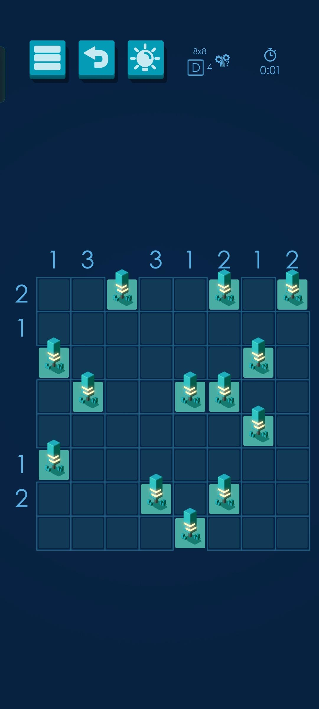

# Solucionador CSP 
[English version](./README_en.md)

## Introducción
`csp-arboles` es un proyecto que surge como una forma más sencilla (y automatizada) de resolver los niveles de un
[juego de árboles y tiendas de campañas de Google Play](https://play.google.com/store/apps/details?id=com.frozax.tentsandtrees&pcampaignid=web_share)
aplicando lo aprendido en mi clase de Heurística y Optimización.

### Características de los niveles
- Los niveles son cuadrículas de dimensiones NxM con una cierta cantidad de árboles.
- Cada árbol tiene asignada una tienda de campaña, que está contigua horizontal o verticalmente.
- En el cuadrado alrededor de una tienda de campaña no puede haber otra tienda.
- La suma de las tiendas de campaña en cada columna y en cada fila debe ser la que se indica en cada columna o fila (pudiendo no indicarse).

## Requerimientos
`csp-arboles` requiere [python constraint](https://pypi.org/project/python-constraint/) >= 1.4.0

Además, `csp-arboles` ha sido desarrollado usando Python 3.10, aunque probablemente funcione con versiones de Python 3 anteriores.

## Uso
Lo único realmente necesario de este repositorio es el archivo `csp-arboles.py`.
La carpeta `tests/` contiene algunas pruebas que he realizado (excepto `arboles0` y `arboles1`, el resto son niveles del juego).

Para ejecutar se le pasa el archivo con el problema a resolver como argumento:
```
$ python csp-arboles ./tests/arboles0
```
Una solución se mostrará por salida estandar.

### Formato de los problemas
El programa espera un archivo de texto con los siguientes datos:
- Dimensión del problema: XxY
- Número de tiendas que debe haber en cada columna, separadas por espacios
- Número de tiendas que debe haber en cada fila, separadas por espacios
- Representación del nivel por filas marcando los árboles con `x` y las casillas en blanco con `-`

El nivel de ejemplo (`arboles6`):
<figure>
    
</figure>

Se representaría así:
```
8x8
1 3 - 3 1 2 1 2
2 1 - - - 1 2 -
--x--x-x
--------
x-----x-
-x--xx--
------x-
x-------
---x-x--
----x---
```

Este solver también es capaz de encontrar soluciones en niveles donde no se indíca el número de tiendas que debe haber en alguna fila o columna como en el ejemplo.
Las filas o columnas en las que no se indica cuántas debe haber se representan con `-`.

### Salida
Tras encontrar una solución al problema, se imprimirá por pantalla formateandola para facilitar la lectura.
Resolviendo el problema de ejemplo obtenemos la siguiente solución:
```
    1   3       3   1   2   1   2
  +---+---+---+---+---+---+---+---+
2 |   | △ | ◻ |   | △ | ◻ |   | ◻ |
1 |   |   |   |   |   |   |   | △ |
  | ◻ | △ |   |   |   | △ | ◻ |   |
  |   | ◻ |   | △ | ◻ | ◻ |   |   |
  |   | △ |   |   |   | △ | ◻ | △ |
1 | ◻ |   |   | △ |   |   |   |   |
2 | △ |   |   | ◻ |   | ◻ | △ |   |
  |   |   |   | △ | ◻ |   |   |   |
  +---+---+---+---+---+---+---+---+
```

Las tiendas se muestran con triangulos (△) y los árboles con cuadrados (◻).

# License #

MIT License

Copyright (c) 2023, Yago Brotón Gutiérrez

Permission is hereby granted, free of charge, to any person obtaining a copy
of this software and associated documentation files (the "Software"), to deal
in the Software without restriction, including without limitation the rights
to use, copy, modify, merge, publish, distribute, sublicense, and/or sell
copies of the Software, and to permit persons to whom the Software is
furnished to do so, subject to the following conditions:

The above copyright notice and this permission notice shall be included in all
copies or substantial portions of the Software.

THE SOFTWARE IS PROVIDED "AS IS", WITHOUT WARRANTY OF ANY KIND, EXPRESS OR
IMPLIED, INCLUDING BUT NOT LIMITED TO THE WARRANTIES OF MERCHANTABILITY,
FITNESS FOR A PARTICULAR PURPOSE AND NONINFRINGEMENT. IN NO EVENT SHALL THE
AUTHORS OR COPYRIGHT HOLDERS BE LIABLE FOR ANY CLAIM, DAMAGES OR OTHER
LIABILITY, WHETHER IN AN ACTION OF CONTRACT, TORT OR OTHERWISE, ARISING FROM,
OUT OF OR IN CONNECTION WITH THE SOFTWARE OR THE USE OR OTHER DEALINGS IN THE
SOFTWARE.


# Authors #

Yago Brotón Gutiérrez <100451322@alumnos.uc3m.es>
Bachelor in Computer Science and Engineering <https://www.uc3m.es/bachelor-degree/computer-science>
Universidad Carlos III de Madrid <https://www.uc3m.es/home>
